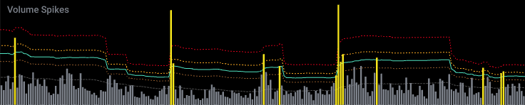
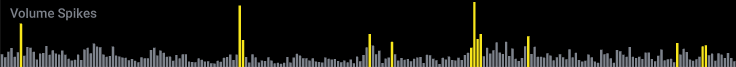

# Volume Spikes

## Location

Volume-based -> Volume Spikes

## Description
A volume histogram that highlights bars when they are above a simple moving
average threshold. The threshold is defined at a number of standard
deviations from the moving average. For visual reference, bands are plotted
at 1, 2, and 3 standard deviations from the moving average.

## Params

- period: The simple moving average period.
- stdDev: The number of standard deviations that define the threshold.
- spikeColor: The color used to highlight volume bars.

## Plots

- Volume: The volume bars.
- Threshold: The threshold value.
- SMA: The simple moving average.
- Band1: 1 standard deviation from the moving average.
- Band2: 2 standard deviations from the moving average.
- Band3: 3 standard deviations from the moving average.

## Examples

